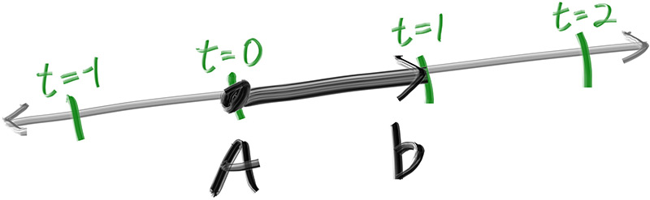
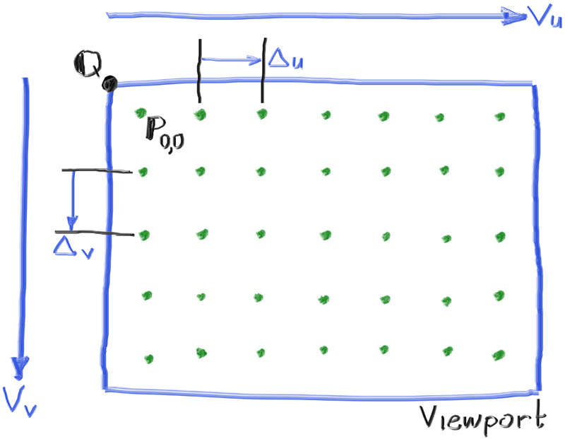
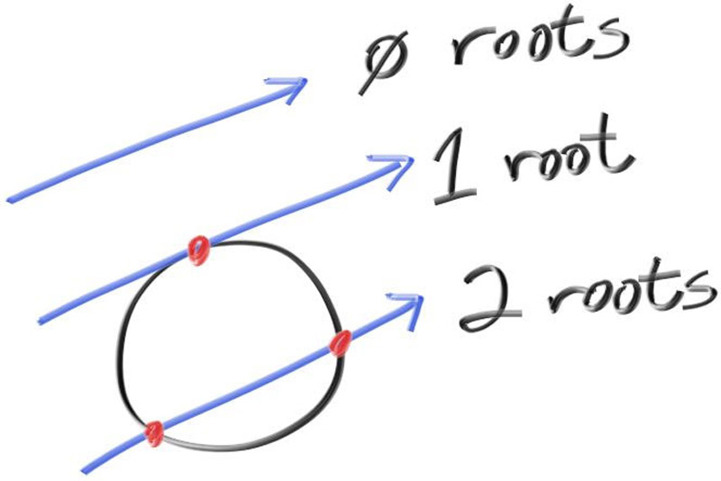

- note: I try to adopt a philosophy similar to what I understand rust uses via structs, impls, and traits
- the base vec3 class is analogous to a struct, where the only behaviour defined is to make the class' objects interact in the way np.ndarrays interact (essentially giving us a base data type)
- point3 adds functionality specific for position points

**The vec3 class**
-  the function of the original code appears totally redundant with the numpy ndarray class, so the vec3 class only adds validation that the ndarray matches the shape of the vec3
-  original code has vec3 and point3 as aliases of the same classes, used to visualize the geometric concepts
   -  IE a vector (has a direction) vs a point in space
   -  this seems like bad practice, will look for ways to refactor

**Rays, a Simple Camera, and Background**
```
- The one thing that all ray tracers have is a ray class and a computation of what color is seen along a ray. Let’s think of a ray as a function P(t)=A+tb. 
  - P is a position along a line in 3D. 
  - A is the ray origin and b is the ray direction. 
  - The ray parameter t is a real number (double in the code). For positive t you get only the parts in front of A (a ray)
```



- the source code seems to adopt a problematic variable naming scheme. I think an object shouldn't be named "orig" but rather "origin_point" (inspiration is [this youtube video](https://www.youtube.com/watch?v=-J3wNP6u5YU&t=31s&pp=ygUQbmFtaW5nIHZhcmlhYmxlcw%3D%3D))
- the source code has a getter and setter in the ray class, however as it is public, it seems unpythonic to implement this ; you can just call the object actributes from the object
- the source code implements functions to optionally return an immutable reference to object members. I dont think this is possible in python


At its core, a ray tracer sends rays through pixels and computes the color seen in the direction of those rays. The involved steps are
1. Calculate the ray from the “eye” through the pixel
2. Determine which objects the ray intersects, and
3. Compute a color for the closest intersection point.
- we'll be using a 16:9 aspect ratio (width is 1.7778x the size of height)
  - a fixed aspect ratio makes it easier to debug
  - setting image width + aspect ratio and calculating height allows for easier image scaling than calculating aspect ratio
- we need to set up a *viewport*: the virtual collections of pixels in the 3d space from which the rays are cast
- aspect_ratio is an ideal ratio, which we approximate as best as possible with the integer-based ratio of image width over image height. The viewport is based on the inter based ratio
- we will define the camera center: a point in 3D space from which all scene rays will originate (aka *eye point*)
  - right-handed coordinates:
    - eye point at origin (0,0,0)
    - y axis shoots up from origin
    - x axis shoots right from origin
    - -z axis points towards viewport

- The image coordinate Y-axis is inverted from the camera's y-axis: Y increases going down the image (but the eyepoint's y-axis shoots up from it)

- the distance from the edges of the viewpoint to the edges of the pixel grid will be half the distance from the pixels to eachother, to ensure even distribution
- In this figure, we have the viewport, the pixel grid for a 7×5 resolution image, the viewport upper left corner Q, the pixel P0,0 location, the viewport vector Vu (viewport_u), the viewport vector Vv (viewport_v), and the pixel delta vectors Δu and Δv
- this is implemented in camera.py
- note: this is the first time we see major performance dropoffs. Some of this is to be expected; python is slower than c++. But I believe leveraging numpy should allow for some optimizations.

**5. Adding a Sphere**
- The equation for a sphere of radius r that is centered at the origin is an important mathematical equation: r = sqrt(x^2+y^2+z^2)
  - the norm (the sqrt of the sum of the squares of its coords, which cooresponds with the length of the line drawn between that point and the sphere center, which is here the origin) of a point inside the sphere will be less than the radius, and if it's outside the sphere it will be greater
- if the sphere's center is at an arbitrary point C and not the origin the equation for a point P on its surface is:
  - ```dot((C - P),(C - P)) = r^2```
    - note ```dot(a,b) = sum([x*y for x,y in zip(a,b)])``` with a and b being point3's
  - note that the formula for our ray is `P(t) = Q + td`
  - subbing it in (separating for t):
    - `dot(((-td + (C - Q))),(-td + (C - Q))) = r^2`
  - this can be refactored using the distributive property of vector algebra (the same as polynomial distribution)
    - `dot(-td,-td) + dot(-td,(C-Q)) + dot((C-Q),-td) + dot((C-Q),(C-Q)) = r^2`
  - pulling out the scalars:
    -  `-t^2 * dot(d,d) + -t * dot(d,(C-Q)) + -t * dot((C-Q),d)  + dot((C-Q),(C-Q)) = r^2`
 -  note that the dot product is commutative `(dot(a,b) = dot(b,a))`:
    -  `-t^2 * dot(d,d) + -2t * dot(d,(C-Q)) + dot((C-Q),(C-Q)) - r^2 = 0`
 -  the dot product calculations and r are all scalar and known, so the unknown we're solving for is t. From this lens, the equation is a quadratic equation. 
    -  The quadratic formula to solve `ax^2 +bx + c = 0` is:
       -  `(-b +/= sqrt(b^2 - 4ac)) / 2a`
       -  here:
          -  `a = dot(d,d)`
          -  `b = -2 * dot(d,(C-Q))`
          -  `c = dot((C-Q),(C-Q)) - r^2`
    -  interpretation:
       -  if t is negative, there are no solutions (the ray doesn't intersect with the sphere)
       -  if t is positive, there are 2 solutions (the ray intersects with the sphere twice)
       -  if t is 0, there is 1 solution (the ray intersects with the sphere once, grazing the surface)
    -  For now, the number of collisions is the important part, and this can be solved with the discriminant:
       -  `b^2 - 4ac`



**Surface Normals and Multiple Objects**
  - First, let’s get ourselves a surface normal so we can shade. This is a vector that is perpendicular to the surface at the point of intersection.
  - sphere normals can be made unit length simply by dividing by the sphere radius, avoiding the square root entirely.
  - in this project: we will adopt the policy that all normal vectors will be of unit length.